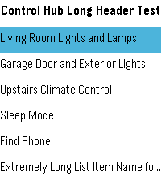
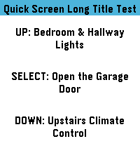
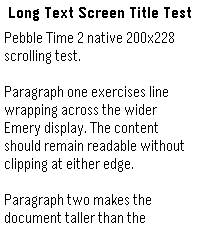

# Pebble Time 2 / Emery Port

This document is the durable handoff for the Pebble Time 2 port of AutoPebble. It summarizes the engineering decisions, current state, test strategy, and remaining work so future contributors do not need to reconstruct the project from dozens of commits and CI runs.

## Source lineage

- Original project: João Dias' `AutoPebble-Pebble-app` source.
- This repository was forked from the later community-maintained `clach04/AutoPebble-Pebble-app` fork, branch `Mediocre-Put2826`, because it already contained useful post-original fixes and Pebble platform improvements.
- PT2 production work is on `pebble-time-2`.
- Tracking PR: #1, **Pebble Time 2 / Emery support**.
- The completed ActionBar development history remains on `actionbar-prototype` / draft PR #2 for reference; the curated final implementation was promoted to `pebble-time-2` in commit `9f5bd3b6d63d3dc6d2643513582cda7050bc1ac8`.

No explicit software license was found during the initial source audit. Public release/redistribution has not yet been decided; resolve licensing before publishing a stable build beyond private testing.

## Compatibility contract

The port is intentionally conservative about AutoPebble's external behavior.

Do not change unless a future design explicitly requires it:

- App UUID: `1b2d45a5-c00a-4f89-b567-4cf4d2d78b2f`
- Android AutoPebble companion compatibility
- AppMessage command/key protocol
- Tasker-facing behavior and command semantics

Caller-supplied fonts, row sizes, titles, and other explicit AutoPebble settings remain authoritative. PT2-specific defaults improve the out-of-box layout without overriding explicit values.

## Target platforms

- Primary new platform: `emery` / Pebble Time 2
- Native PT2 display: 200×228
- Legacy targets retained: `aplite`, `basalt`, `chalk`

`package.json` includes all four targets, and the current RePebble SDK compiles them successfully.

## Screen inventory

The active AutoPebble content UI consists of three screen types:

1. **List**
2. **Quick Screen**
3. **Text Screen**

There is also startup/tutorial UI. `SETTINGS` is a command type that changes persisted behavior rather than displaying another content screen. An old `INDIVIDUAL` screen type constant remains, but this fork has no active implementation/dispatch for it. `detailView.c` is commented-out legacy code and `listView.c` is not another active screen.

## Important fixes made during the port

### Compiler/correctness

The modern compiler exposed a real inherited out-of-bounds bug:

- List capacity is 30.
- `AutoPebbleList.cellSizes` was only 20 elements.
- Initialization wrote indices 20–29 past the end of the array.

The array now contains 30 entries.

A separate inherited Text Screen helper bug was fixed: the Text Screen replacement path previously allocated the wrong screen object type.

### List

PT2 defaults use:

- Gothic 18 for normal rows instead of Gothic 14
- 32 px default rows instead of 25 px

Explicit caller-provided fonts and cell sizes still win. Legacy-width watches retain legacy defaults. The default menu index now initializes both `section = 0` and `row = 0`.

### Quick Screen

The production PT2 Quick Screen now uses Pebble's native `ActionBarLayer` on wide rectangular watches.

Final PT2 behavior:

- full-height native right-edge ActionBar; its frame is not manually resized or shortened
- native ActionBar button press animation/highlighting
- Up / Select / Down app resources aligned to the three physical buttons
- action-label centers aligned to the native Emery ActionBar centers at approximately y = 54 / 114 / 174
- preferred action-label font: Gothic 28 Bold
- automatic fallback to Gothic 24 Bold only when 28 Bold will not fit the 58 px action region
- explicit caller-supplied `textFont` remains authoritative
- optional title/context uses Gothic 18 Bold by default and does not recreate the old colored title banner
- no-title layouts are supported
- labels wrap and clip inside the available content region

The ActionBar click provider preserves the existing AutoPebble single-click, long-click, and multi-click subscriptions. No AppMessage or Tasker protocol changes were made.

The native ActionBar path is intentionally limited to wide **rectangular** watches. Chalk is also 180 px wide, so width alone is not used as the discriminator. Chalk retains the existing adaptive round Quick Screen layout and does not instantiate the ActionBar.

The current Up/Select/Down bitmaps are app resources rather than firmware-provided icons. They are neutral positional/Pebble-style indicators; arbitrary AutoPebble action text cannot safely be mapped to semantic icons without additional information. A backward-compatible optional per-button icon parameter may be considered later, but only after the core port is fully proven on hardware. Do not infer icon semantics from action labels and do not extend the protocol merely for cosmetics during stabilization.

### Text Screen

The legacy fixed 144 px title width was removed.

The PT2 layout uses:

- full native width
- a fixed title
- body-only scrolling
- small horizontal body padding on the wider display
- pagination-aware text layout and page scrolling on PT2, preventing page boundaries from cutting through glyphs

Legacy rectangular platforms keep their previous scrolling behavior where practical.

## Emulator and CI strategy

The repository contains a GitHub Actions build workflow plus a CI-only emulator harness.

The normal production PBW is built first. The CI harness then creates a disposable emulator-only build that drives the real production screen renderer. Synthetic demo behavior is not included in the production PBW.

Earlier hardening covered the three content screens, including List input/selection, Text scrolling/paging, long labels, titles, no-title Quick layouts, and explicit legacy overrides.

The final ActionBar gate additionally verifies on Emery:

- the production Quick renderer actually creates the native ActionBar
- title and no-title rendering
- single-click dispatch through the ActionBar provider
- long-click dispatch through the ActionBar provider
- native held-button visual feedback
- stacking a second Quick Screen, selecting from it, popping it, and restoring the first screen/provider correctly

A separate Chalk emulator regression verifies that the production Quick renderer reports the native ActionBar inactive and captures a round Quick Screen reference screenshot.

GitHub Actions run #72 (`32742112334`) on production commit `9f5bd3b6d63d3dc6d2643513582cda7050bc1ac8` passed the production build, Emery ActionBar hardening diagnostics, and Chalk isolation regression.

After the first physical PT2 install exposed vertical glyph clipping in the Quick Screen title and action labels, hardware-fix branch `pt2-hardware-fixes` added deliberate vertical render headroom instead of sizing layers tightly to emulator-reported glyph bounds. The exact observed `Media Volume / +5% / Nothing Playing · --% / -5%` case is now reproduced in CI. The same hardware-aware title headroom was applied to the PT2 Text Screen after source review showed similarly tight Gothic 18 Bold title geometry.

GitHub Actions run #80 (`33033381156`) on commit `1d3d13fcee71f5e1d4d207384ffd47fa7b7a9648` passed the production build, existing Emery ActionBar gates, Chalk isolation regression, and new Emery screenshots for Quick, Text, and List. These emulator images are clean, but because the original clipping was hardware-only they reduce risk rather than proving the physical fix.

Synthetic xdotool double-click injection was investigated separately. The same double-click failure occurred with AutoPebble's inherited direct Window click provider and with the ActionBar provider, while single and long clicks passed. The ActionBar was therefore not the cause. Existing multi-click subscriptions remain unchanged; **multi-click is a mandatory physical PT2 test item** rather than an emulator gate.

A phone-less emulator initially made long tests nondeterministic because production AutoPebble responds to Bluetooth disconnects by closing its windows. The CI-only demo therefore avoids production phone/Bluetooth startup and uses a harmless keeper window to keep the app active. Production Bluetooth behavior was not changed.

Transient screenshots and logs from routine CI runs should remain GitHub Actions artifacts rather than being committed to Git.

## Curated visual references

Only durable reference images are kept in `docs/screenshots/`.

### Initial native Emery launch

### Current PT2 List

### Current PT2 Quick Screen

### Current PT2 Text Screen

## Current project status

The emulator-side PT2 port is structurally complete and hardened, and the first limited physical PT2 smoke test has been performed.

Completed physical checks:

- candidate PBW installed successfully over the existing app with the preserved UUID
- app launched successfully
- an existing Tasker → AutoPebble action reached the watch successfully
- native Quick Screen ActionBar appeared on the real PT2

That first hardware test also found a real rendering issue that the emulator had not shown: the Quick Screen title and middle action label were vertically clipped. The current `pt2-hardware-fixes` branch adds PT2 render headroom for Quick Screen labels/title and Text Screen title geometry. Run #80 validates the changed production build plus Quick/Text/List emulator references without regressions.

A known-good rollback PBW has been identified and preserved: the community-modded **Classic Pebble menu color** AutoPebble v1.11 build with SHA-256 `4b102bd3d0924b8c045888f9141a65bd16faddf9377d921f2931377fb180e0cd`.

The consolidated physical PT2 hardware validation passed on run #80. The dedicated Tasker test project reported:

`PT2 run80 | list=1 visual=GOOD | quick US=1 UL=0 UM=0 MS=0 ML=1 MM=0 DS=0 DL=0 DM=1 | text=GOOD`

This confirms on real PT2 hardware:

- List navigation/selection succeeded and visual rendering was good
- the previously clipped Quick Screen geometry rendered correctly
- Up single-click fired exactly once
- Select long-click fired exactly once
- Down multi-click/double-click fired exactly once
- no unintended single/long/multi Quick actions fired
- Text Screen rendering/scroll sanity was good
- watch → Tasker command routing worked during the guided test

The physical multi-click result closes the emulator-only uncertainty around double-click injection.

The validated hardware-fix branch was promoted through PR #3 into `pebble-time-2` at merge commit `08b3df57b3a13c309008d2f5ac8a4933968ec64c`.

Post-promotion production CI run #83 (`33205542980`) passed every build and emulator gate on that exact merge commit, including production PBW build, Emery ActionBar diagnostics, PT2 Quick/Text/List regression screenshots, and Chalk non-ActionBar isolation. The canonical production PBW from run #83 has SHA-256 `263bc45b5fb0188b342f590831b52c00d6590d0e25f6715de362e1f4871141e8`.

The run #83 PBW is functionally the same source build as the physically tested run #80 candidate. Its platform binaries differ from run #80 only in the embedded build timestamp field; all application/resource sizes and resources are unchanged. No additional physical retest is required for that rebuild.

## Remaining work

1. Keep Sleep as Android behavior unchanged. Its successful handoff/no-overlay behavior was already established outside this dedicated renderer/button test, and the hardware-fix changes touch only Quick/Text geometry plus CI.
2. Continue the separate AutoPebble Control Hub functional backlog independently; AV Receiver Volume and Pause / Resume are application-level checks rather than blockers for the PT2 watch-app port.
3. Decide later whether this work should remain private, be shared informally, or become a public release. If public distribution is chosen, resolve source/icon licensing and package/release documentation before publishing.
4. When the public/private release decision is made, decide whether PR #1 should be finalized/merged into the inherited default branch or whether `pebble-time-2` should remain the maintained production branch.

The PT2 watch-app port itself is now hardware-validated and production-CI-validated. No further PT2 physical retest is required unless later production code changes or a new hardware-specific issue appears.

## Future PT2-native ideas

These are deliberately deferred beyond the completed compatibility port. They should be treated as optional follow-on features, each designed so existing AutoPebble behavior and protocol remain backward-compatible unless a deliberate versioned extension is introduced.

- **Touchscreen support:** investigate Pebble Time 2 / Emery touch APIs and add touch gestures only where they improve navigation or quick actions without making physical-button operation worse. Prefer additive touch affordances rather than replacing the existing button model.
- **Sound support:** investigate PT2 audio/speaker APIs for optional feedback, alerts, or action confirmation. Any sound behavior should be opt-in or explicitly requested by the originating AutoPebble action so existing automations remain silent.
- **Optional ActionBar icons:** consider a backward-compatible per-button icon parameter for Quick Screens instead of trying to infer semantics from arbitrary action labels.
- **ActionBar asset polish:** verify whether current generated/equivalent icons should be replaced with official-compatible Pebble assets if licensing/source provenance can be established.

## Documentation policy

Keep this file concise and durable. Update it when an important architectural decision, compatibility constraint, test strategy, or release-state fact changes.

Do not commit every emulator screenshot, CI log, PBW artifact, token, URL containing credentials, or device-specific private automation detail. Use CI artifacts for transient build/test evidence and keep only a small set of curated reference screenshots in Git.
